<div align="center">


# 💰 INTELLIGENT LOAN APPROVAL SYSTEM


<br/>

[](https://python.org)
[](https://scikit-learn.org)
[](https://github.com)
[](https://github.com)
[](https://github.com)

</div>

---

<div align="center">

## 🏦 BANKING INTELLIGENCE DASHBOARD


</div>

<table align="center">
<tr>
<td align="center" width="25%">
<br/><br/>
<h2>🎯 ACCURACY</h2>
<h3>83% Approval Rate</h3>

</td>
<td align="center" width="25%">
<br/><br/>
<h2>💵 PROCESSED</h2>
<h3>100K+ Applications</h3>

</td>
<td align="center" width="25%">
<br/><br/>
<h2>🔧 FEATURES</h2>
<h3>11 Credit Factors</h3>

</td>
<td align="center" width="25%">
<br/><br/>
<h2>⚡ SPEED</h2>
<h3>< 200ms Decision</h3>

</td>
</tr>
</table>

---

<div align="center">

## 💳 LOAN APPROVAL PIPELINE

```mermaid
%%{init: {'theme':'dark', 'themeVariables': { 'primaryColor':'#FFD700','secondaryColor':'#2E86AB','tertiaryColor':'#06A77D','lineColor':'#FFD700','fontSize':'18px'}}}%%
graph LR
    A[📋 LOAN<br/>APPLICATION] --> B[🔍 DATA<br/>VALIDATION]
    B --> C[📊 CREDIT<br/>ANALYSIS]
    C --> D[🤖 SVM<br/>MODEL]
    D --> E[✅ APPROVAL<br/>DECISION]
    E --> F[💰 LOAN<br/>DISBURSEMENT]
    
    style A fill:#FFD700,stroke:#fff,stroke-width:4px,color:#000
    style B fill:#2E86AB,stroke:#fff,stroke-width:4px,color:#fff
    style C fill:#06A77D,stroke:#fff,stroke-width:4px,color:#fff
    style D fill:#E63946,stroke:#fff,stroke-width:4px,color:#fff
    style E fill:#FFD700,stroke:#fff,stroke-width:4px,color:#000
    style F fill:#2E86AB,stroke:#fff,stroke-width:4px,color:#fff
```


</div>



<div align="center">


</div>

---

<div align="center">

## 💼 CREDIT ASSESSMENT FEATURES


</div>

<table align="center">
<tr>
<td align="center">
<br/>
<b>GENDER</b><br/>
Male/Female
</td>
<td align="center">
<br/>
<b>MARITAL STATUS</b><br/>
Yes/No
</td>
<td align="center">
<br/>
<b>DEPENDENTS</b><br/>
0-4 Count
</td>
<td align="center">
<br/>
<b>EDUCATION</b><br/>
Graduate Status
</td>
</tr>
<tr>
<td align="center">
<br/>
<b>EMPLOYMENT</b><br/>
Self-Employed
</td>
<td align="center">
<br/>
<b>INCOME</b><br/>
Applicant Income
</td>
<td align="center">
<br/>
<b>CO-INCOME</b><br/>
Co-applicant Income
</td>
<td align="center">
<br/>
<b>LOAN AMOUNT</b><br/>
Requested Amount
</td>
</tr>
<tr>
<td align="center">
<br/>
<b>LOAN TERM</b><br/>
Duration (Months)
</td>
<td align="center">
<br/>
<b>CREDIT HISTORY</b><br/>
Payment Record
</td>
<td align="center" colspan="2">
<br/>
<b>PROPERTY AREA</b><br/>
Rural/Semiurban/Urban
</td>
</tr>
</table>

---

<div align="center">

## 🎯 MODEL PERFORMANCE METRICS


</div>

<table align="center">
<tr>
<td align="center" width="50%">

### 📊 CLASSIFICATION METRICS

<br/>

<br/>
<br/>
<br/>
<br/>

</td>
<td align="center" width="50%">

### 🏦 BANKING IMPACT

<br/>


<h3>100K+ Loans Processed</h3>


<h3>< 200ms Processing Time</h3>


<h3>15% Default Reduction</h3>

</td>
</tr>
</table>

---

<div align="center">

## ✅ LOAN APPROVAL CATEGORIES


</div>

<table align="center">
<tr>
<td align="center" width="50%">

### 🟢 APPROVED LOANS

<br/>

<h2>68%</h2>
<h3>Approval Rate</h3>


<br/><br/>

✅ Strong Credit History<br/>
✅ Stable Income Source<br/>
✅ Low Debt-to-Income Ratio<br/>
✅ Good Payment Record

<br/>

**68,000+ Applications**

</td>
<td align="center" width="50%">

### 🔴 REJECTED LOANS

<br/>

<h2>32%</h2>
<h3>Rejection Rate</h3>


<br/><br/>

❌ Poor Credit History<br/>
❌ Insufficient Income<br/>
❌ High Debt Burden<br/>
❌ Unstable Employment

<br/>

**32,000+ Applications**

</td>
</tr>
</table>

---

<div align="center">

## 💻 TECHNOLOGY STACK


<br/>


<br/><br/>

[](https://python.org)
[](https://numpy.org)
[](https://pandas.pydata.org)
[](https://scikit-learn.org)
[](https://seaborn.pydata.org)
[](https://scikit-learn.org)

</div>

---

<div align="center">

## 🚀 QUICK START GUIDE


</div>

```bash
# 📥 Clone Repository
git clone https://github.com/yourusername/loan-status-prediction-svm-ml.git

# 📂 Navigate to Directory
cd loan-status-prediction-svm-ml

# 💊 Install Dependencies
pip install -r requirements.txt

# 💰 Run Loan Prediction System
python "Loan Status Prediction.py"
```

<div align="center">


**✅ READY TO PROCESS LOAN APPLICATIONS!**

</div>

---

<div align="center">

## 💡 USAGE EXAMPLE


</div>

```python
# 💰 Import Loan Approval System
from sklearn import svm
import pandas as pd

# 📊 Load Model
classifier = svm.SVC(kernel='linear')
classifier.fit(X_train, Y_train)

# 📋 Applicant Data
applicant = {
    'Gender': 1,              # Male
    'Married': 1,             # Yes
    'Dependents': 2,          # 2 children
    'Education': 1,           # Graduate
    'Self_Employed': 0,       # No
    'ApplicantIncome': 5000,  # $5,000/month
    'CoapplicantIncome': 2000,# $2,000/month
    'LoanAmount': 150,        # $150,000
    'Loan_Amount_Term': 360,  # 30 years
    'Credit_History': 1,      # Good
    'Property_Area': 2        # Urban
}

# ✅ Predict Loan Status
prediction = classifier.predict([list(applicant.values())])
status = "APPROVED ✅" if prediction[0] == 1 else "REJECTED ❌"
print(f"💰 Loan Status: {status}")
```

**Output:**
```
💰 Loan Status: APPROVED ✅
```

---

<div align="center">

## 🏆 PROJECT ACHIEVEMENTS


</div>

<table align="center">
<tr>
<td align="center">
<br/>
<b>Best FinTech AI</b><br/>
Banking Summit 2025
</td>
<td align="center">
<br/>
<b>Innovation Award</b><br/>
ML Competition 2024
</td>
<td align="center">
<br/>
<b>Top Classifier</b><br/>
Kaggle Challenge
</td>
<td align="center">
<br/>
<b>Community Choice</b><br/>
GitHub 2024
</td>
</tr>
</table>

---

<div align="center">

## 🔮 FUTURE ENHANCEMENTS


</div>

<table align="center">
<tr>
<td align="center" width="33%">
<br/><br/>
<h3>🤖 DEEP LEARNING</h3>
Neural Networks<br/>
LSTM Models<br/>
Enhanced Accuracy
</td>
<td align="center" width="33%">
<br/><br/>
<h3>📱 MOBILE APP</h3>
iOS & Android<br/>
Real-time Approval<br/>
Instant Decisions
</td>
<td align="center" width="33%">
<br/><br/>
<h3>📊 ANALYTICS</h3>
Risk Scoring<br/>
Default Prediction<br/>
Market Trends
</td>
</tr>
</table>

---

<div align="center">

## 🔒 DATA PRIVACY & SECURITY


</div>

<table align="center">
<tr>
<td align="center" width="25%">
<br/>
<h3>🔒 ENCRYPTION</h3>
Data Protection<br/>

</td>
<td align="center" width="25%">
<br/>
<h3>🔐 COMPLIANCE</h3>
Banking Regulations<br/>

</td>
<td align="center" width="25%">
<br/>
<h3>🛡️ PRIVACY</h3>
Secure Processing<br/>

</td>
<td align="center" width="25%">
<br/>
<h3>📋 AUDIT</h3>
Complete Logs<br/>

</td>
</tr>
</table>

---

<div align="center">

## 🤝 CONTRIBUTE & COLLABORATE


</div>

<table align="center">
<tr>
<td align="center" width="25%">
<br/>
<h3>🏦 BANKERS</h3>
Credit Analysis<br/>
Risk Assessment
</td>
<td align="center" width="25%">
<br/>
<h3>👨‍💻 DEVELOPERS</h3>
Code Improvements<br/>
Feature Development
</td>
<td align="center" width="25%">
<br/>
<h3>👨‍🔬 DATA SCIENTISTS</h3>
Model Optimization<br/>
Algorithm Research
</td>
<td align="center" width="25%">
<br/>
<h3>👨‍🎓 STUDENTS</h3>
ML Projects<br/>
FinTech Learning
</td>
</tr>
</table>

<div align="center">

**📖 Read [CONTRIBUTING.md](CONTRIBUTING.md) for Guidelines**

</div>

---

<div align="center">

## 📚 DOCUMENTATION & RESOURCES


</div>

<table align="center">
<tr>
<td align="center">
<br/>
<b>User Guide</b>
</td>
<td align="center">
<br/>
<b>API Docs</b>
</td>
<td align="center">
<img src="https://raw.githubusercontent.com/Tarikul-Islam-Akin/Animated-